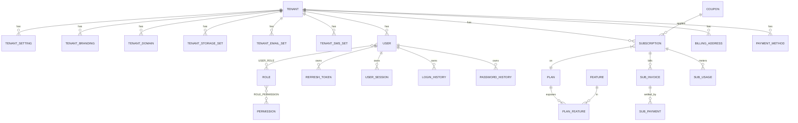
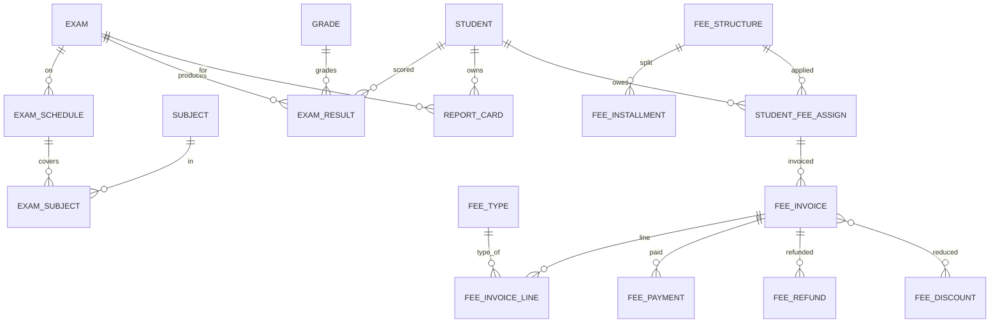
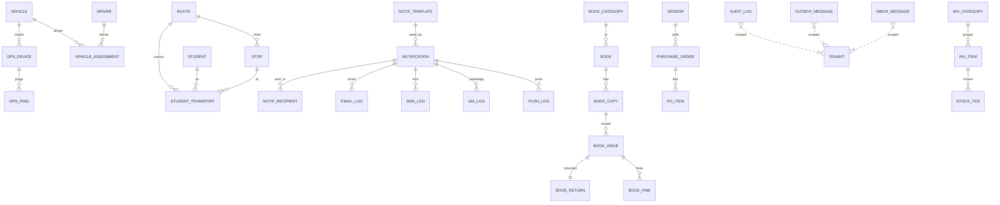

# 01 — Database ERD, Mermaid Diagram, DBML

> All diagrams here are scoped to **business cores** for readability. The complete physical schema (every column) is in `02-DATABASE-SCHEMA.md`.

---

## 5. Complete ERD

### 5.1 Logical Entity Map (per module, with cross-context references)

```
TENANT MGMT
  Tenant 1───* TenantSetting
         1───* TenantBranding
         1───* TenantDomain
         1───* TenantStorageSettings
         1───* TenantEmailSettings
         1───* TenantSmsSettings

IDENTITY
  User *───* Role           (UserRole)
  Role *───* Permission     (RolePermission)
  User 1───* RefreshToken
  User 1───* UserSession
  User 1───* LoginHistory
  User 1───* PasswordHistory

BILLING
  Plan 1───* PlanFeature *───1 Feature
  Tenant 1───* Subscription ───1 Plan
  Subscription 1───* SubscriptionInvoice 1───* SubscriptionPayment
  Subscription 1───* SubscriptionUsage
  Tenant 1───* BillingAddress
  Tenant 1───* PaymentMethod
  Coupon 1───* Subscription (optional)

ACADEMICS
  AcademicYear 1───* Term
  AcademicYear 1───* Class
  Class 1───* Section
  Class 1───* SubjectAssignment *───1 Subject
  Section 1───* Timetable 1───* Period
  Section 1───1 ClassTeacher (Employee)

STUDENTS
  Student 1───* StudentAddress
          1───* StudentDocument
          1───* StudentMedicalRecord
          1───* StudentEmergencyContact
          1───* StudentStatusHistory
          1───* StudentPromotionHistory
          1───* StudentParent *───1 Parent
  Student 1───* StudentEnrollment ───1 AcademicYear, Class, Section

EMPLOYEES
  Employee 1───* EmployeeDocument
           1───* EmployeeBankAccount
           1───* EmployeeAttendance
           1───* EmployeePayroll
  Department 1───* Employee
  Designation 1───* Employee

ATTENDANCE
  AttendanceSession 1───* StudentAttendance
  Section 1───* AttendanceSession
  AcademicYear 1───* AttendanceSession

EXAMS
  Exam 1───* ExamSchedule 1───* ExamSubject
  Exam 1───* ExamResult ───1 Student, Subject
  Grade 1───* ExamResult
  Student 1───* ReportCard ───1 Exam

FEES
  FeeStructure 1───* FeeInstallment
  FeeStructure 1───* StudentFeeAssignment 1───* FeeInvoice
  FeeInvoice 1───* FeeInvoiceLine ───1 FeeType
  FeeInvoice 1───* FeePayment
  FeeInvoice 1───* FeeRefund
  FeeInvoice *───* FeeDiscount

TRANSPORT
  Route 1───* Stop
  Vehicle 1───* VehicleAssignment ───1 Driver
  Vehicle 1───* GPSDevice 1───* GPSPing
  Route 1───* StudentTransportAssignment ───1 Student, Stop, Vehicle

COMMUNICATION
  NotificationTemplate 1───* Notification 1───* NotificationRecipient
  Notification 1───* EmailLog
  Notification 1───* SmsLog
  Notification 1───* WhatsAppLog
  Notification 1───* PushLog

LIBRARY
  BookCategory 1───* Book 1───* BookCopy
  BookCopy 1───* BookIssue 1───1 BookReturn
  BookIssue 1───* BookFine

INVENTORY
  InventoryCategory 1───* InventoryItem
  Vendor 1───* PurchaseOrder 1───* PurchaseOrderItem
  InventoryItem 1───* StockTransaction

AUDIT
  AuditLog (append-only)
  ActivityLog (append-only)
  ErrorLog (append-only)
  OutboxMessage (transactional)
  InboxMessage (transactional)
  BackgroundJob
```

### 5.2 Cross-Context Reference Conventions

- All references that cross a bounded context use **value-object IDs** in domain code (e.g., `StudentId`, `AcademicYearId`) — never object navigation.
- At the database level we still create FK constraints (in shared DB) for referential integrity, but EF Core configurations declare them as `NoAction` to keep modules from accidentally cascading across contexts.
- Cross-context **read views** are exposed via `IModuleApi` query interfaces, not via direct table joins.

---

## 6. Mermaid ER Diagram

> Rendered subset (full graphs would be unreadable). Generate per-module mermaid in your wiki by filtering `02-DATABASE-SCHEMA.md`.

### 6.1 Tenant + Identity + Billing



### 6.2 Academics + Students + Attendance

```mermaid
erDiagram
    ACADEMIC_YEAR ||--o{ TERM           : contains
    ACADEMIC_YEAR ||--o{ CLASS          : groups
    CLASS ||--o{ SECTION                : has
    CLASS ||--o{ SUBJECT_ASSIGNMENT     : maps
    SUBJECT ||--o{ SUBJECT_ASSIGNMENT   : taught_in
    SECTION ||--o{ TIMETABLE            : owns
    TIMETABLE ||--o{ PERIOD             : has

    STUDENT ||--o{ STUDENT_ADDRESS      : has
    STUDENT ||--o{ STUDENT_DOCUMENT     : has
    STUDENT ||--o{ STUDENT_MEDICAL      : has
    STUDENT ||--o{ STUDENT_EMERGENCY    : has
    STUDENT ||--o{ STUDENT_STATUS_HIS   : has
    STUDENT ||--o{ STUDENT_PROMO_HIS    : has
    STUDENT ||--o{ STUDENT_PARENT       : has
    PARENT  ||--o{ STUDENT_PARENT       : in
    STUDENT ||--o{ STUDENT_ENROLLMENT   : per_year
    ACADEMIC_YEAR ||--o{ STUDENT_ENROLLMENT : year
    SECTION ||--o{ STUDENT_ENROLLMENT   : section

    SECTION ||--o{ ATTEND_SESSION       : holds
    ACADEMIC_YEAR ||--o{ ATTEND_SESSION : year
    ATTEND_SESSION ||--o{ STUDENT_ATTENDANCE : marks
    STUDENT ||--o{ STUDENT_ATTENDANCE   : marked
```

### 6.3 Exams + Fees



### 6.4 Transport + Communication + Library + Inventory + Audit



---

## 7. DBML

> Compatible with [dbdiagram.io](https://dbdiagram.io). Trimmed for clarity to one representative table per concept; the **full** schema (all columns) lives in `02-DATABASE-SCHEMA.md`.
> Save the block below as `school-erp.dbml`.

```dbml
Project SchoolErpSaaS {
  database_type: 'SQL Server'
  Note: 'Multi-tenant Modular Monolith — every business table carries TenantId, audit columns, soft delete and RowVersion.'
}

// ───────────────────────── Tenant ─────────────────────────
Table tenant.Tenants {
  TenantId          uniqueidentifier [pk, default: `newsequentialid()`]
  Code              varchar(64)      [not null, note: 'Slug used in URLs / API headers']
  Name              nvarchar(200)    [not null]
  LegalName         nvarchar(200)
  Status            tinyint          [not null, note: '0=Pending,1=Active,2=Suspended,3=Deprovisioned']
  PlanId            uniqueidentifier
  TimeZone          varchar(64)      [not null, default: 'UTC']
  Locale            varchar(16)      [not null, default: 'en-US']
  Currency          char(3)          [not null, default: 'USD']
  CreatedAt         datetime2(3)     [not null, default: `sysutcdatetime()`]
  CreatedBy         uniqueidentifier
  UpdatedAt         datetime2(3)
  UpdatedBy         uniqueidentifier
  IsDeleted         bit              [not null, default: 0]
  DeletedAt         datetime2(3)
  DeletedBy         uniqueidentifier
  RowVersion        rowversion
  Indexes {
    Code [unique, name: 'UX_Tenants_Code']
    (Status, IsDeleted) [name: 'IX_Tenants_Status']
  }
}

Table tenant.TenantDomains {
  TenantDomainId    uniqueidentifier [pk, default: `newsequentialid()`]
  TenantId          uniqueidentifier [not null, ref: > tenant.Tenants.TenantId]
  Host              varchar(253)     [not null]
  IsPrimary         bit              [not null, default: 0]
  IsVerified        bit              [not null, default: 0]
  CreatedAt         datetime2(3)     [not null, default: `sysutcdatetime()`]
  CreatedBy         uniqueidentifier
  UpdatedAt         datetime2(3)
  UpdatedBy         uniqueidentifier
  IsDeleted         bit              [not null, default: 0]
  DeletedAt         datetime2(3)
  DeletedBy         uniqueidentifier
  RowVersion        rowversion
  Indexes {
    Host  [unique, name: 'UX_TenantDomains_Host']
    (TenantId, IsPrimary) [name: 'IX_TenantDomains_Tenant_Primary']
  }
}

// ───────────────────────── Identity ─────────────────────────
Table identity.Users {
  UserId            uniqueidentifier [pk, default: `newsequentialid()`]
  TenantId          uniqueidentifier [not null, ref: > tenant.Tenants.TenantId]
  Email             nvarchar(256)    [not null]
  NormalizedEmail   nvarchar(256)    [not null]
  UserName          nvarchar(128)    [not null]
  NormalizedUserName nvarchar(128)   [not null]
  PasswordHash      varbinary(512)
  PasswordSalt      varbinary(64)
  FirstName         nvarchar(100)
  LastName          nvarchar(100)
  PhoneNumber       varchar(32)
  PhoneConfirmed    bit              [not null, default: 0]
  EmailConfirmed    bit              [not null, default: 0]
  TwoFactorEnabled  bit              [not null, default: 0]
  LockoutEndUtc     datetime2(3)
  AccessFailedCount int              [not null, default: 0]
  IsActive          bit              [not null, default: 1]
  CreatedAt         datetime2(3)     [not null, default: `sysutcdatetime()`]
  CreatedBy         uniqueidentifier
  UpdatedAt         datetime2(3)
  UpdatedBy         uniqueidentifier
  IsDeleted         bit              [not null, default: 0]
  DeletedAt         datetime2(3)
  DeletedBy         uniqueidentifier
  RowVersion        rowversion
  Indexes {
    (TenantId, NormalizedEmail) [unique, name: 'UX_Users_Tenant_Email']
    (TenantId, NormalizedUserName) [unique, name: 'UX_Users_Tenant_UserName']
  }
}

Table identity.Roles {
  RoleId            uniqueidentifier [pk, default: `newsequentialid()`]
  TenantId          uniqueidentifier [not null]
  Name              nvarchar(128)    [not null]
  NormalizedName    nvarchar(128)    [not null]
  IsSystem          bit              [not null, default: 0]
  CreatedAt         datetime2(3)     [not null, default: `sysutcdatetime()`]
  CreatedBy         uniqueidentifier
  UpdatedAt         datetime2(3)
  UpdatedBy         uniqueidentifier
  IsDeleted         bit              [not null, default: 0]
  DeletedAt         datetime2(3)
  DeletedBy         uniqueidentifier
  RowVersion        rowversion
  Indexes {
    (TenantId, NormalizedName) [unique, name: 'UX_Roles_Tenant_Name']
  }
}

Table identity.Permissions {
  PermissionId      uniqueidentifier [pk, default: `newsequentialid()`]
  Code              varchar(128)     [not null, unique, note: 'students.read, fees.write, etc.']
  Name              nvarchar(200)    [not null]
  Module            varchar(64)      [not null]
  CreatedAt         datetime2(3)     [not null, default: `sysutcdatetime()`]
}

Table identity.UserRoles {
  UserRoleId        uniqueidentifier [pk, default: `newsequentialid()`]
  TenantId          uniqueidentifier [not null]
  UserId            uniqueidentifier [not null, ref: > identity.Users.UserId]
  RoleId            uniqueidentifier [not null, ref: > identity.Roles.RoleId]
  AssignedAt        datetime2(3)     [not null, default: `sysutcdatetime()`]
  AssignedBy        uniqueidentifier
  Indexes {
    (TenantId, UserId, RoleId) [unique, name: 'UX_UserRoles']
  }
}

Table identity.RolePermissions {
  RolePermissionId  uniqueidentifier [pk, default: `newsequentialid()`]
  TenantId          uniqueidentifier [not null]
  RoleId            uniqueidentifier [not null, ref: > identity.Roles.RoleId]
  PermissionId      uniqueidentifier [not null, ref: > identity.Permissions.PermissionId]
  GrantedAt         datetime2(3)     [not null, default: `sysutcdatetime()`]
  Indexes {
    (TenantId, RoleId, PermissionId) [unique, name: 'UX_RolePermissions']
  }
}

Table identity.RefreshTokens {
  RefreshTokenId    uniqueidentifier [pk, default: `newsequentialid()`]
  TenantId          uniqueidentifier [not null]
  UserId            uniqueidentifier [not null, ref: > identity.Users.UserId]
  TokenHash         binary(32)       [not null]
  JwtId             varchar(64)      [not null]
  ExpiresAtUtc      datetime2(3)     [not null]
  CreatedAt         datetime2(3)     [not null, default: `sysutcdatetime()`]
  CreatedBy         uniqueidentifier
  RevokedAtUtc      datetime2(3)
  ReplacedByTokenId uniqueidentifier
  ClientIp          varchar(45)
  UserAgent         nvarchar(400)
  Indexes {
    TokenHash [unique, name: 'UX_RefreshTokens_Hash']
    (TenantId, UserId, ExpiresAtUtc) [name: 'IX_RefreshTokens_User']
  }
}

// ───────────────────────── Billing ─────────────────────────
Table billing.Plans {
  PlanId          uniqueidentifier [pk, default: `newsequentialid()`]
  Code            varchar(64)      [not null, unique]
  Name            nvarchar(200)    [not null]
  Description     nvarchar(2000)
  BillingCycle    tinyint          [not null, note: '1=Monthly,2=Quarterly,3=Annual']
  Price           decimal(18,4)    [not null]
  Currency        char(3)          [not null, default: 'USD']
  IsActive        bit              [not null, default: 1]
  CreatedAt       datetime2(3)     [not null, default: `sysutcdatetime()`]
  CreatedBy       uniqueidentifier
  UpdatedAt       datetime2(3)
  UpdatedBy       uniqueidentifier
  IsDeleted       bit              [not null, default: 0]
  DeletedAt       datetime2(3)
  DeletedBy       uniqueidentifier
  RowVersion      rowversion
}

Table billing.Subscriptions {
  SubscriptionId  uniqueidentifier [pk, default: `newsequentialid()`]
  TenantId        uniqueidentifier [not null, ref: > tenant.Tenants.TenantId]
  PlanId          uniqueidentifier [not null, ref: > billing.Plans.PlanId]
  Status          tinyint          [not null, note: '0=Trialing,1=Active,2=PastDue,3=Cancelled,4=Expired']
  TrialEndsAtUtc  datetime2(3)
  CurrentPeriodStartUtc datetime2(3) [not null]
  CurrentPeriodEndUtc   datetime2(3) [not null]
  CancelAtPeriodEnd     bit          [not null, default: 0]
  CouponId        uniqueidentifier
  CreatedAt       datetime2(3)     [not null, default: `sysutcdatetime()`]
  CreatedBy       uniqueidentifier
  UpdatedAt       datetime2(3)
  UpdatedBy       uniqueidentifier
  IsDeleted       bit              [not null, default: 0]
  DeletedAt       datetime2(3)
  DeletedBy       uniqueidentifier
  RowVersion      rowversion
  Indexes {
    (TenantId, Status) [name: 'IX_Subscriptions_Tenant_Status']
    (CurrentPeriodEndUtc, Status) [name: 'IX_Subscriptions_PeriodEnd']
  }
}

Table billing.SubscriptionInvoices {
  InvoiceId       uniqueidentifier [pk, default: `newsequentialid()`]
  TenantId        uniqueidentifier [not null]
  SubscriptionId  uniqueidentifier [not null, ref: > billing.Subscriptions.SubscriptionId]
  Number          varchar(40)      [not null]
  Status          tinyint          [not null, note: '0=Draft,1=Open,2=Paid,3=Void,4=Uncollectible']
  Subtotal        decimal(18,4)    [not null]
  TaxTotal        decimal(18,4)    [not null]
  DiscountTotal   decimal(18,4)    [not null]
  Total           decimal(18,4)    [not null]
  Currency        char(3)          [not null]
  IssuedAtUtc     datetime2(3)     [not null]
  DueAtUtc        datetime2(3)     [not null]
  PaidAtUtc       datetime2(3)
  CreatedAt       datetime2(3)     [not null, default: `sysutcdatetime()`]
  CreatedBy       uniqueidentifier
  UpdatedAt       datetime2(3)
  UpdatedBy       uniqueidentifier
  IsDeleted       bit              [not null, default: 0]
  DeletedAt       datetime2(3)
  DeletedBy       uniqueidentifier
  RowVersion      rowversion
  Indexes {
    (TenantId, Number) [unique]
    (TenantId, Status, DueAtUtc) [name: 'IX_SubInv_Status_Due']
  }
}

// ───────────────────────── Academics ─────────────────────────
Table academic.AcademicYears {
  AcademicYearId    uniqueidentifier [pk, default: `newsequentialid()`]
  TenantId          uniqueidentifier [not null]
  Code              varchar(20)      [not null]
  Name              nvarchar(100)    [not null]
  StartDate         date             [not null]
  EndDate           date             [not null]
  IsCurrent         bit              [not null, default: 0]
  Status            tinyint          [not null, note: '0=Planned,1=Active,2=Closed']
  CreatedAt         datetime2(3)     [not null, default: `sysutcdatetime()`]
  CreatedBy         uniqueidentifier
  UpdatedAt         datetime2(3)
  UpdatedBy         uniqueidentifier
  IsDeleted         bit              [not null, default: 0]
  DeletedAt         datetime2(3)
  DeletedBy         uniqueidentifier
  RowVersion        rowversion
  Indexes {
    (TenantId, Code) [unique, name: 'UX_AY_Tenant_Code']
    (TenantId, IsCurrent) [name: 'IX_AY_Tenant_Current']
  }
}

Table academic.Classes {
  ClassId           uniqueidentifier [pk, default: `newsequentialid()`]
  TenantId          uniqueidentifier [not null]
  AcademicYearId    uniqueidentifier [not null, ref: > academic.AcademicYears.AcademicYearId]
  Name              nvarchar(50)     [not null]
  GradeLevel        smallint         [not null]
  DisplayOrder      smallint         [not null, default: 0]
  CreatedAt         datetime2(3)     [not null, default: `sysutcdatetime()`]
  CreatedBy         uniqueidentifier
  UpdatedAt         datetime2(3)
  UpdatedBy         uniqueidentifier
  IsDeleted         bit              [not null, default: 0]
  DeletedAt         datetime2(3)
  DeletedBy         uniqueidentifier
  RowVersion        rowversion
  Indexes {
    (TenantId, AcademicYearId, Name) [unique]
  }
}

Table academic.Sections {
  SectionId         uniqueidentifier [pk, default: `newsequentialid()`]
  TenantId          uniqueidentifier [not null]
  ClassId           uniqueidentifier [not null, ref: > academic.Classes.ClassId]
  Name              nvarchar(20)     [not null]
  Capacity          smallint         [not null, default: 40]
  ClassTeacherId    uniqueidentifier
  CreatedAt         datetime2(3)     [not null, default: `sysutcdatetime()`]
  CreatedBy         uniqueidentifier
  UpdatedAt         datetime2(3)
  UpdatedBy         uniqueidentifier
  IsDeleted         bit              [not null, default: 0]
  DeletedAt         datetime2(3)
  DeletedBy         uniqueidentifier
  RowVersion        rowversion
  Indexes {
    (TenantId, ClassId, Name) [unique]
  }
}

// ───────────────────────── Students ─────────────────────────
Table student.Students {
  StudentId         uniqueidentifier [pk, default: `newsequentialid()`]
  TenantId          uniqueidentifier [not null]
  AdmissionNumber   varchar(40)      [not null]
  FirstName         nvarchar(100)    [not null]
  MiddleName        nvarchar(100)
  LastName          nvarchar(100)
  Gender            tinyint          [not null]
  DateOfBirth       date             [not null]
  Nationality       nvarchar(80)
  BloodGroup        varchar(8)
  Religion          nvarchar(64)
  Category          nvarchar(64)
  PhotoBlobKey      varchar(512)
  Status            tinyint          [not null, note: '0=Applicant,1=Enrolled,2=Graduated,3=Withdrawn,4=Suspended']
  AdmissionDate     date
  ExitDate          date
  CreatedAt         datetime2(3)     [not null, default: `sysutcdatetime()`]
  CreatedBy         uniqueidentifier
  UpdatedAt         datetime2(3)
  UpdatedBy         uniqueidentifier
  IsDeleted         bit              [not null, default: 0]
  DeletedAt         datetime2(3)
  DeletedBy         uniqueidentifier
  RowVersion        rowversion
  Indexes {
    (TenantId, AdmissionNumber) [unique, name: 'UX_Students_Admission']
    (TenantId, Status, IsDeleted) [name: 'IX_Students_Status']
    (TenantId, LastName, FirstName) [name: 'IX_Students_Name']
  }
}

Table student.StudentEnrollments {
  EnrollmentId      uniqueidentifier [pk, default: `newsequentialid()`]
  TenantId          uniqueidentifier [not null]
  StudentId         uniqueidentifier [not null, ref: > student.Students.StudentId]
  AcademicYearId    uniqueidentifier [not null, ref: > academic.AcademicYears.AcademicYearId]
  ClassId           uniqueidentifier [not null, ref: > academic.Classes.ClassId]
  SectionId         uniqueidentifier [not null, ref: > academic.Sections.SectionId]
  RollNumber        varchar(20)
  EnrolledOn        date             [not null]
  Status            tinyint          [not null, note: '0=Active,1=Promoted,2=Detained,3=TC,4=Cancelled']
  CreatedAt         datetime2(3)     [not null, default: `sysutcdatetime()`]
  CreatedBy         uniqueidentifier
  UpdatedAt         datetime2(3)
  UpdatedBy         uniqueidentifier
  IsDeleted         bit              [not null, default: 0]
  DeletedAt         datetime2(3)
  DeletedBy         uniqueidentifier
  RowVersion        rowversion
  Indexes {
    (TenantId, StudentId, AcademicYearId) [unique]
    (TenantId, AcademicYearId, ClassId, SectionId)
  }
}

// ───────────────────────── Attendance ─────────────────────────
Table attendance.AttendanceSessions {
  SessionId         uniqueidentifier [pk, default: `newsequentialid()`]
  TenantId          uniqueidentifier [not null]
  AcademicYearId    uniqueidentifier [not null]
  SectionId         uniqueidentifier [not null]
  PeriodId          uniqueidentifier
  SessionDate       date             [not null]
  SessionType       tinyint          [not null, note: '0=Daily,1=Period,2=Event']
  Status            tinyint          [not null, note: '0=Open,1=Finalized']
  TakenByUserId     uniqueidentifier
  CreatedAt         datetime2(3)     [not null, default: `sysutcdatetime()`]
  CreatedBy         uniqueidentifier
  UpdatedAt         datetime2(3)
  UpdatedBy         uniqueidentifier
  IsDeleted         bit              [not null, default: 0]
  DeletedAt         datetime2(3)
  DeletedBy         uniqueidentifier
  RowVersion        rowversion
  Indexes {
    (TenantId, SectionId, SessionDate, PeriodId) [unique]
    (TenantId, SessionDate)
  }
}

Table attendance.StudentAttendance {
  StudentAttendanceId  bigint   [pk, increment, note: 'BIGINT IDENTITY for high write volume']
  TenantId             uniqueidentifier [not null]
  SessionId            uniqueidentifier [not null, ref: > attendance.AttendanceSessions.SessionId]
  StudentId            uniqueidentifier [not null]
  Status               tinyint  [not null, note: '0=Present,1=Absent,2=Late,3=Leave,4=Excused']
  Remarks              nvarchar(400)
  MarkedAtUtc          datetime2(3) [not null, default: `sysutcdatetime()`]
  MarkedByUserId       uniqueidentifier
  CreatedAt            datetime2(3) [not null, default: `sysutcdatetime()`]
  CreatedBy            uniqueidentifier
  UpdatedAt            datetime2(3)
  UpdatedBy            uniqueidentifier
  IsDeleted            bit       [not null, default: 0]
  DeletedAt            datetime2(3)
  DeletedBy            uniqueidentifier
  RowVersion           rowversion
  Indexes {
    (TenantId, SessionId, StudentId) [unique]
    (TenantId, StudentId, MarkedAtUtc) [name: 'IX_SA_Student_Date']
  }
}

// ───────────────────────── Fees ─────────────────────────
Table fees.FeeStructures {
  FeeStructureId    uniqueidentifier [pk, default: `newsequentialid()`]
  TenantId          uniqueidentifier [not null]
  AcademicYearId    uniqueidentifier [not null]
  ClassId           uniqueidentifier
  Name              nvarchar(150)    [not null]
  TotalAmount       decimal(18,4)    [not null]
  Currency          char(3)          [not null, default: 'USD']
  CreatedAt         datetime2(3)     [not null, default: `sysutcdatetime()`]
  CreatedBy         uniqueidentifier
  UpdatedAt         datetime2(3)
  UpdatedBy         uniqueidentifier
  IsDeleted         bit              [not null, default: 0]
  DeletedAt         datetime2(3)
  DeletedBy         uniqueidentifier
  RowVersion        rowversion
}

Table fees.FeeInvoices {
  InvoiceId         uniqueidentifier [pk, default: `newsequentialid()`]
  TenantId          uniqueidentifier [not null]
  StudentId         uniqueidentifier [not null]
  AcademicYearId    uniqueidentifier [not null]
  Number            varchar(40)      [not null]
  Status            tinyint          [not null, note: '0=Draft,1=Issued,2=PartPaid,3=Paid,4=Overdue,5=Cancelled']
  Subtotal          decimal(18,4)    [not null]
  DiscountTotal     decimal(18,4)    [not null]
  TaxTotal          decimal(18,4)    [not null]
  Total             decimal(18,4)    [not null]
  AmountDue         decimal(18,4)    [not null]
  Currency          char(3)          [not null]
  IssuedOn          date             [not null]
  DueOn             date             [not null]
  CreatedAt         datetime2(3)     [not null, default: `sysutcdatetime()`]
  CreatedBy         uniqueidentifier
  UpdatedAt         datetime2(3)
  UpdatedBy         uniqueidentifier
  IsDeleted         bit              [not null, default: 0]
  DeletedAt         datetime2(3)
  DeletedBy         uniqueidentifier
  RowVersion        rowversion
  Indexes {
    (TenantId, Number) [unique]
    (TenantId, Status, DueOn)
    (TenantId, StudentId, IssuedOn)
  }
}

Table fees.FeePayments {
  PaymentId         uniqueidentifier [pk, default: `newsequentialid()`]
  TenantId          uniqueidentifier [not null]
  InvoiceId         uniqueidentifier [not null, ref: > fees.FeeInvoices.InvoiceId]
  Amount            decimal(18,4)    [not null]
  Currency          char(3)          [not null]
  Method            tinyint          [not null, note: '0=Cash,1=Card,2=NetBanking,3=UPI,4=Wallet,5=BankTransfer,6=Cheque']
  GatewayProvider   varchar(64)
  GatewayPaymentId  varchar(128)
  Status            tinyint          [not null, note: '0=Initiated,1=Succeeded,2=Failed,3=Refunded,4=PartiallyRefunded']
  ReceivedAtUtc     datetime2(3)     [not null]
  CreatedAt         datetime2(3)     [not null, default: `sysutcdatetime()`]
  CreatedBy         uniqueidentifier
  UpdatedAt         datetime2(3)
  UpdatedBy         uniqueidentifier
  IsDeleted         bit              [not null, default: 0]
  DeletedAt         datetime2(3)
  DeletedBy         uniqueidentifier
  RowVersion        rowversion
  Indexes {
    GatewayPaymentId [unique]
    (TenantId, InvoiceId)
    (TenantId, Status, ReceivedAtUtc)
  }
}

// ───────────────────────── Audit / Outbox / Inbox ─────────────────────────
Table audit.OutboxMessages {
  OutboxMessageId   bigint           [pk, increment]
  MessageId         uniqueidentifier [not null, unique, default: `newid()`]
  TenantId          uniqueidentifier [not null]
  Module            varchar(64)      [not null]
  Exchange          varchar(128)     [not null]
  RoutingKey        varchar(256)     [not null]
  EventType         varchar(256)     [not null]
  ContentType       varchar(64)      [not null, default: 'application/json']
  SchemaVersion     varchar(16)      [not null, default: 'v1']
  Payload           nvarchar(max)    [not null]
  Headers           nvarchar(max)
  CorrelationId     uniqueidentifier
  CausationId       uniqueidentifier
  OccurredOnUtc     datetime2(3)     [not null]
  AvailableAtUtc    datetime2(3)     [not null]
  ProcessedAtUtc    datetime2(3)
  Attempts          int              [not null, default: 0]
  LastError         nvarchar(max)
  Status            tinyint          [not null, note: '0=Pending,1=Processing,2=Published,3=Failed,4=DeadLettered']
  Indexes {
    (Status, AvailableAtUtc)
    (TenantId, OccurredOnUtc)
  }
}

Table audit.InboxMessages {
  InboxMessageId    bigint           [pk, increment]
  MessageId         uniqueidentifier [not null, unique]
  TenantId          uniqueidentifier [not null]
  Consumer          varchar(256)     [not null, note: 'Module + handler full type name']
  Module            varchar(64)      [not null]
  EventType         varchar(256)     [not null]
  SchemaVersion     varchar(16)      [not null]
  Payload           nvarchar(max)    [not null]
  Headers           nvarchar(max)
  CorrelationId     uniqueidentifier
  CausationId       uniqueidentifier
  ReceivedAtUtc     datetime2(3)     [not null]
  ProcessedAtUtc    datetime2(3)
  Attempts          int              [not null, default: 0]
  LastError         nvarchar(max)
  Status            tinyint          [not null, note: '0=Received,1=Processing,2=Processed,3=Failed,4=DeadLettered']
  Indexes {
    (Consumer, MessageId) [unique]
    (Status, ReceivedAtUtc)
  }
}

Table audit.AuditLogs {
  AuditLogId        bigint           [pk, increment]
  TenantId          uniqueidentifier [not null]
  UserId            uniqueidentifier
  Module            varchar(64)      [not null]
  Action            varchar(64)      [not null, note: 'Create/Update/Delete/Login/etc.']
  EntityType        varchar(128)     [not null]
  EntityId          varchar(64)      [not null]
  OldValues         nvarchar(max)
  NewValues         nvarchar(max)
  ChangeSet         nvarchar(max)
  IpAddress         varchar(45)
  UserAgent         nvarchar(400)
  CorrelationId     uniqueidentifier
  OccurredAtUtc     datetime2(3)     [not null]
  Indexes {
    (TenantId, OccurredAtUtc)
    (TenantId, EntityType, EntityId)
  }
}
```
